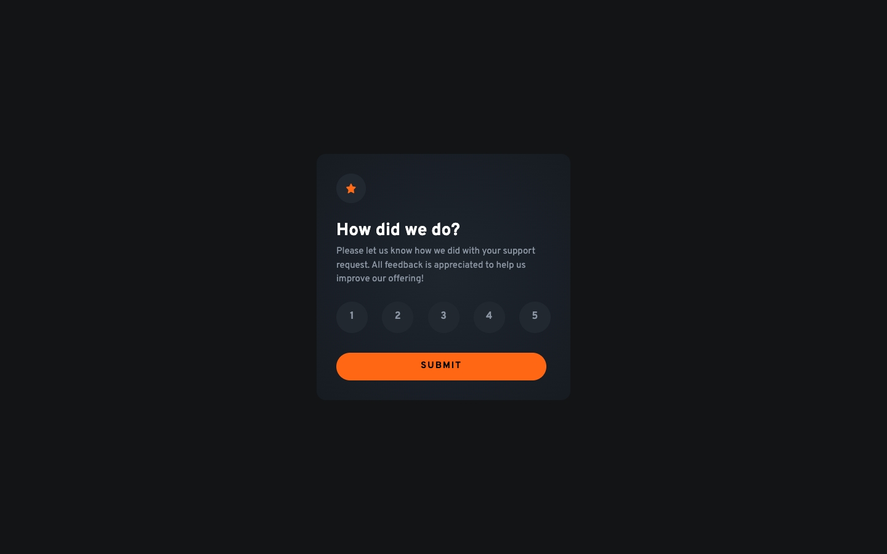
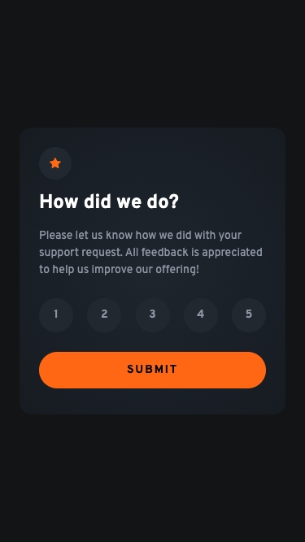
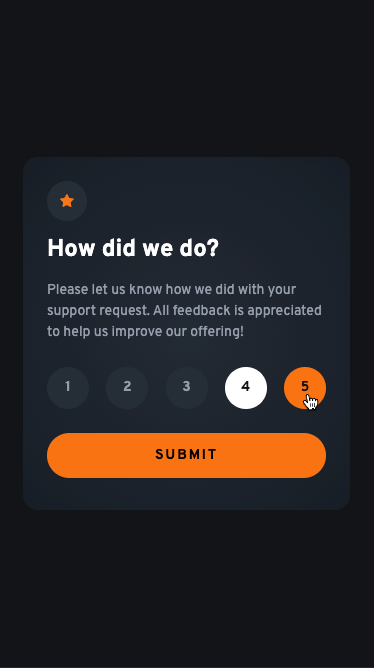
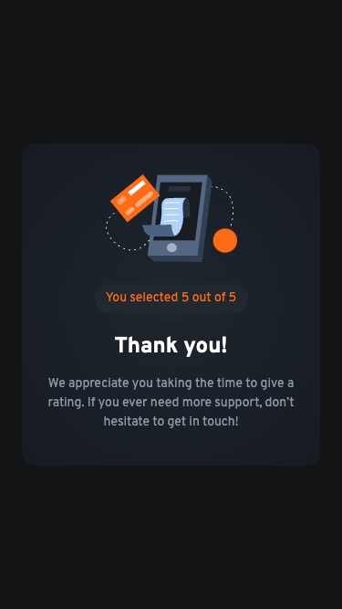

<p align="center">
  
</p>

<h1 align="center">Interactive Rating Component</h1>

<div align="center">
  <h3>
    <a href="https://vivianmca-rating-component.netlify.app/">
      Live
    </a>
    <span> | </span>
    <a href="https://www.frontendmentor.io/solutions/interactive-rating-component-using-react-and-cube-css-methodology-dj5LSHaA3H">
      Solution
    </a>
   <span> | </span>
    <a href="https://www.frontendmentor.io/challenges/interactive-rating-component-koxpeBUmI">
      Challenge
    </a>
  </h3>
</div>
<div align="center">
   Solution for a challenge from  <a href="https://www.frontendmentor.io/" target="_blank">frontendmentor.io</a>.
</div>
<br> <!-- omit in toc -->

## Table of contents <!-- omit in toc -->

- [Overview](#overview)
  - [About](#about)
  - [Screenshot](#screenshot)
- [My process](#my-process)
  - [Built with](#built-with)
  - [What I learned](#what-i-learned)
    - [_Managing Back Navigation in React_](#managing-back-navigation-in-react)
    - [_Using a Custom Hook (`useMediaQuery`)_](#using-a-custom-hook-usemediaquery)
    - [_Structuring a Component-Based UI_](#structuring-a-component-based-ui)
  - [Continued development](#continued-development)
  - [Getting started](#getting-started)
    - [Installation \& Setup](#installation--setup)
    - [Deployment](#deployment)
  - [Useful resources](#useful-resources)
- [Author](#author)
- [Acknowledgments](#acknowledgments)

## Overview

### About

Users should be able to:

1. Select and submit a number rating
2. See the "Thank you" card state after submitting a rating
3. See hover and focus states for all interactive elements on the page

### Screenshot

<!-- <p align="center">
  
</p> -->
<p align="center"><em>Mobile design</em></p>
<p align="center">
  
</p>
<br/>

<p align="center"><em>Active state</em></p>
<p align="center">
  
</p>
<br/>

<p align="center"><em>"Thank You" card state</em></p>
<p align="center">
  
</p>
<br/>

## My process

### Built with

- React.js
- React Hooks (`useState`, `useEffect`, and custom `useMediaQuery`)
- CSS Modules
- CSS Custom Properties
- CUBE CSS methodology
- CSS Flexbox & Grid
- Mobile-first workflow
- Netlify for deployment

### What I learned

This project was a full deep dive into structuring a React component-based application while implementing best practices for state management, hooks, and styling methodologies. Here are my few key takeaways:

#### _Managing Back Navigation in React_

One of the first things I noticed was that clicking the back button didn’t return to the rating card. My instinct was to navigate back, so I implemented a solution using the popstate event to handle browser history changes.

```jsx
// Listen for browser back button
useEffect(() => {
  const handlePopState = () => {
    setIsSubmitted(false); // Reset submission state
    setSelectedRating(null); // Reset rating selection
  };

  window.addEventListener("popstate", handlePopState);
  return () => window.removeEventListener("popstate", handlePopState);
}, []);
```

This ensures that when users click the back button, the app resets correctly instead of getting stuck in a submitted state.

#### _Using a Custom Hook (`useMediaQuery`)_

For the desktop version, I needed to adjust the card size dynamically. I implemented a custom React Hook (`useMediaQuery`) to check screen width and conditionally apply different class names for styling.

```jsx
function useMediaQuery(query) {
  // Tracks whether the media query matches or not
  const [matches, setMatches] = useState(() => {
    return window.matchMedia(query).matches; // Initialize state based on current match status
  });

  useEffect(() => {
    const mediaQueryList = window.matchMedia(query); // Create a media query list object
    const updateMatch = (event) => setMatches(event.matches); // Update state when the media query match status changes

    mediaQueryList.addEventListener("change", updateMatch); // Attach the event listener
    return () => {
      mediaQueryList.removeEventListener("change", updateMatch); // Cleanup function to remove the event listener when the component unmounts
    };
  }, [query]); // Runs only when the query changes

  return matches; // Return the boolean value indicating if the query matches
}
```

This allowed me to swap out class names dynamically, especially since I use CSS utility classes, ensuring a smooth transition between mobile and desktop layouts.

#### _Structuring a Component-Based UI_

I focused on keeping my React components modular and reusable, breaking them down into:

- `Card.jsx` – Main rating card
- `RatingButton.jsx` – Individual rating buttons
- `RatingGroup.jsx` – Group of rating buttons
- `SubmitButton.jsx` – Submission button
- `ThankYouCard.jsx `– Thank you message

This structure helped separate concerns, making it easier to manage state and styles independently.

### Continued development

Moving forward, I want to:

- Explore React Context API for managing state globally.
- Improve handling of accessibility (ARIA labels, focus states, screen reader support).
- Continue refining my CSS architecture by balancing utilities with component-scoped styles.

I struggled with `props` management during this project, so I want to hone my skills more in creating React apps and deep dive into other useful hooks that are common in the industry.

### Getting started

#### Installation & Setup

To run this project locally, follow these steps:

1. Clone the repository

```sh
git clone https://github.com/vivian-mca/interactive-rating-component.git
cd your-repo-name
```

2. Install dependencies

```sh
npm install
```

3. Run the development server

```sh
npm run dev
```

This will start the project on http://localhost:5173/ (or another available port if 5173 is in use).

4. Build for production If you want to create an optimized production build:

```sh
npm run build
```

5. Preview the production build

```sh
npm run preview
```

This will serve the built project locally for testing.

#### Deployment

This project is deployed using **Netlify**. If you want to deploy your own version:

1. Push your code to GitHub (or any Git provider).
2. Connect the repository to Netlify.
3. Set the build command:

```arduino
npm run build
```

4. Set the publish directory:

```nginx
dist
```

5. Deploy and share your live project!

### Useful resources

- [React Docs](https://react.dev/reference/react) - They really have great documentation on everything React.
- [CSS Logical Properties and Values](https://css-tricks.com/css-logical-properties-and-values/) - This is a good resource for learning about CSS Logical Properties and Values.
- [CUBE CSS documentation](https://cube.fyi/) - From the docs: "CUBE CSS is a CSS methodology that’s orientated towards simplicity, pragmatism and consistency. It’s designed to work with the medium that you’re working in—often the browser—rather than against it."
- [Every Layout](https://every-layout.dev/) - Extremely helpful resource for simplifying CSS layouts.
- [Figma](https://figma.com/) - Really helpful for extracting information about measurements
- [Modern CSS Reset](https://piccalil.li/blog/a-modern-css-reset/)
- [Perfect Pixel](https://chrome.google.com/webstore/detail/perfectpixel-by-welldonec/dkaagdgjmgdmbnecmcefdhjekcoceebi) - Awesome Chrome extension that helps you to match the pixels of the provided design.
- [Responsively App](https://responsively.app/) - This DevTool helps in responsive web development. It allows you to see mirrored user-interactions across all devices. I find it helpful in finding breaking points and making sure my app is responsive.

## Author

- Frontend Mentor - [@vivian-mca](https://www.frontendmentor.io/profile/vivian-mca)

## Acknowledgments

- [A look at the CUBE CSS methodology in action by Kevin Powell](https://www.youtube.com/watch?v=NanhQvnvbR8)
